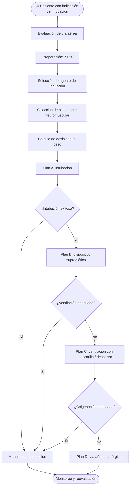

```mermaid
flowchart TD
    START([🫁 Paciente con indicación de intubación]) --> AIRWAY[Evaluación de vía aérea]
    AIRWAY --> PREP[Preparación: 7 P's]
    PREP --> INDUCE[Selección de agente de inducción]
    INDUCE --> PARALYZE[Selección de bloqueante neuromuscular]
    PARALYZE --> DOSE[Cálculo de dosis según peso]
    DOSE --> INTUB[Plan A: intubación]
    INTUB --> SUCCESS{¿Intubación exitosa?}
    SUCCESS -->|Sí| POST[Manejo post-intubación]
    SUCCESS -->|No| PLANB[Plan B: dispositivo supraglótico]
    PLANB --> VENT{¿Ventilación adecuada?}
    VENT -->|Sí| POST
    VENT -->|No| PLANC[Plan C: ventilación con mascarilla / despertar]
    PLANC --> OXY{¿Oxigenación adecuada?}
    OXY -->|Sí| POST
    OXY -->|No| PLAND[Plan D: vía aérea quirúrgica]
    POST --> END([Monitoreo y reevaluación])
    PLAND --> END
```

