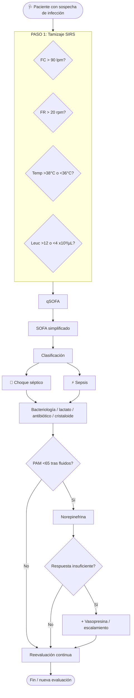

```mermaid
flowchart TD
    START([🩺 Paciente con sospecha de infección]) --> SIRS
    subgraph SIRS["PASO 1: Tamizaje SIRS"]
        S1{FC > 90 lpm?}
        S2{FR > 20 rpm?}
        S3{Temp >38°C o <36°C?}
        S4{Leuc >12 o <4 x10³/µL?}
    end
    SIRS --> QS[qSOFA]
    QS --> SOFA[SOFA simplificado]
    SOFA --> CLASS[Clasificación]
    CLASS --> SHOCK[🚨 Choque séptico]
    CLASS --> SEPSIS[⚡ Sepsis]
    SHOCK --> B1[Bacteriología / lactato / antibiótico / cristaloide]
    SEPSIS --> B1
    B1 --> VASO{PAM <65 tras fluidos?}
    VASO -->|Sí| NE[Norepinefrina]
    VASO -->|No| REEVAL[Reevaluación continua]
    NE --> ESC{Respuesta insuficiente?}
    ESC -->|Sí| VP[+ Vasopresina / escalamiento]
    ESC -->|No| REEVAL
    VP --> REEVAL
    REEVAL --> END([Fin / nueva evaluación])
```

